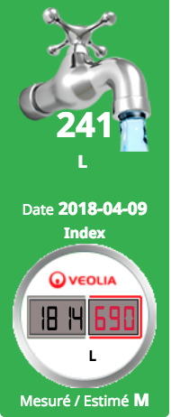

# Description

Ce plugin permet de récupérer le télé-relevé disponible sur les sites Internet de Veolia Eau / Veolia Méditerranée / Tout sur mon eau / Eau en ligne /Eau du grand Lyon / Société des Eaux de l'Essonne (SEE) / VEND'Ô - Tout sur mon eau / Eau de Sénart / Stéphanoise des Eaux / Seynoise des Eaux / Orléanaise des Eaux / Société des Eaux de l'Ouest Parisien (SEOP) / L'eau du Dunkerquois

# Market

Retrouvez le sur le Market Jeedom [ici](https://www.jeedom.com/market/index.php?v=d&p=market&type=plugin&&name=veolia_eau)

# Prévisualisation

# Forum

Lien vers le forum [ici](https://community.jeedom.com/tag/plugin-veolia_eau)
